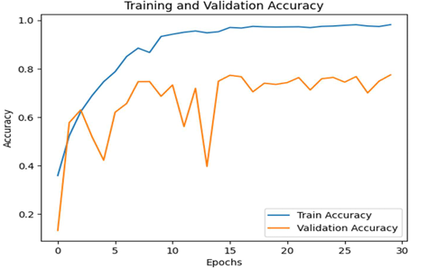
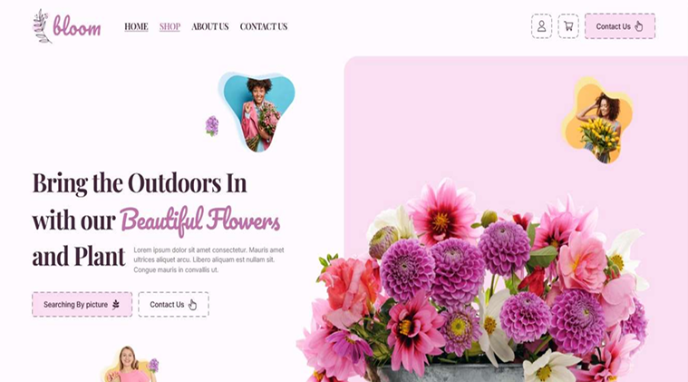

# 🌸 Bloom – Application Web de Reconnaissance et Vente de Fleurs

## 🧠 À propos du projet

**Bloom** est une application web développée avec **Flask**, combinant **intelligence artificielle** et **e-commerce**.  
Elle permet :
- d’**identifier automatiquement des fleurs** à partir d’images via des techniques de **Deep Learning (CNN)** et de **Transfert Learning (MobileNetV2)** ;  
- de proposer un **catalogue interactif** pour la **vente de fleurs et plantes** ;
- de générer des **recommandations intelligentes** basées sur le **traitement du langage naturel (TF-IDF + similarité cosinus)**.

---

## 🚀 Fonctionnalités principales

- 📷 **Reconnaissance d’images** : Identification automatique de la fleur uploadée.
- 🔄 **Transfert Learning (MobileNetV2)** : Meilleure précision et réduction de l’overfitting.
- 🧩 **Recommandation intelligente** : Fleurs similaires proposées selon la description.
- 🛒 **Module e-commerce** : Catalogue interactif, fiches détaillées et filtres de recherche.
- 💬 **Interface intuitive** : Design épuré et navigation fluide.

---

## 🏗️ Architecture du modèle

### 🧩 CNN personnalisé
Première approche avec un modèle convolutionnel entraîné sur un dataset Kaggle de 16 classes de fleurs.  
Problème : **overfitting** dès la 10ᵉ époque (Train Acc > 95 %, Val Acc ≈ 72 %).

📊 **Plot training and validation accuracy (CNN)**  


---

### 🔁 Transfert Learning (MobileNetV2)
Utilisation d’un modèle pré-entraîné sur **ImageNet**, adapté à notre jeu de données.  
Résultats :
- Accuracy d’entraînement : **93.42 %**
- Accuracy de validation : **90.22 %**
- Perte de validation stable

📊 **Plot training and validation accuracy (Transfer Learning)**  


---

## 🖥️ Aperçu de l’application

🏠 **Page d’accueil**


📂 **Chargement d’image**
L’utilisateur peut uploader une image et obtenir instantanément la fleur correspondante avec des détails et suggestions similaires.

🪷 **Catalogue interactif**
Navigation parmi plusieurs fleurs avec filtres dynamiques.

💡 **Recommandations**
Suggestions de fleurs similaires via le modèle NLP TF-IDF.

---

## 🧰 Technologies utilisées

| Domaine | Technologies |
|----------|---------------|
| **Backend** | Flask (Python) |
| **Deep Learning** | TensorFlow, Keras, MobileNetV2 |
| **Recommandation** | TF-IDF, Similarité Cosinus (Scikit-learn) |
| **Base de données** | MySQL |
| **Frontend** | HTML, CSS, Bootstrap, JavaScript |
| **Environnements** | Google Colab, Jupyter Notebook, VS Code |

---

## ⚙️ Installation et exécution

1. **Cloner le projet**
   ```bash
   git clone https://github.com/<ton-username>/bloom.git
   cd bloom
   ```

2. **Créer un environnement virtuel**
   ```bash
   python -m venv venv
   source venv/bin/activate   # sous Linux/Mac
   venv\Scripts\activate      # sous Windows
   ```


3. **Lancer l’application**
   ```bash
   python app.py
   ```

4. **Ouvrir dans le navigateur**
   ```
   http://127.0.0.1:5000/
   ```
---

## 📈 Résultats obtenus

- Réduction significative de l’overfitting grâce au transfert learning.
- Précision du modèle > **90 %** sur le jeu de validation.
- Expérience utilisateur fluide et responsive.
- Recommandations pertinentes via NLP.


---

## 📜 Licence

Ce projet est open-source sous licence **MIT**.  
Vous pouvez le modifier et le redistribuer librement.

---

🌼 *Bloom — L’intelligence artificielle au service de la nature !*
